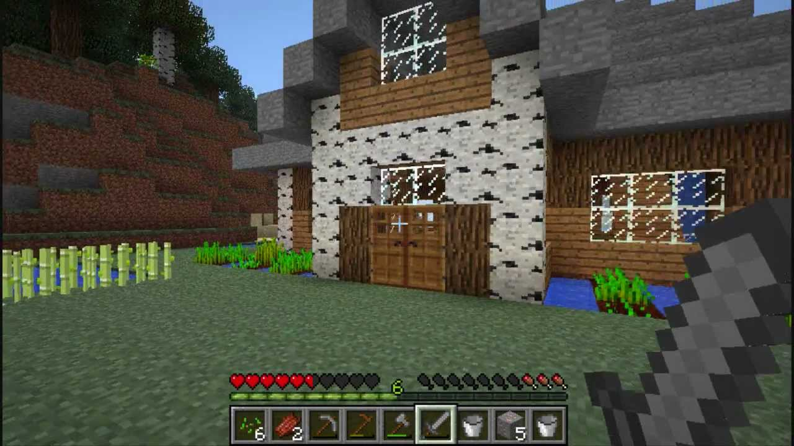
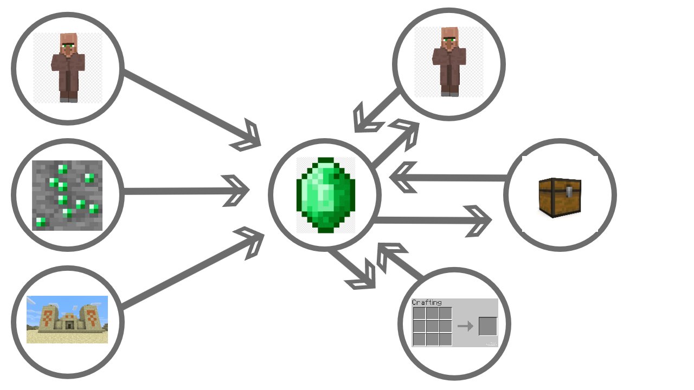
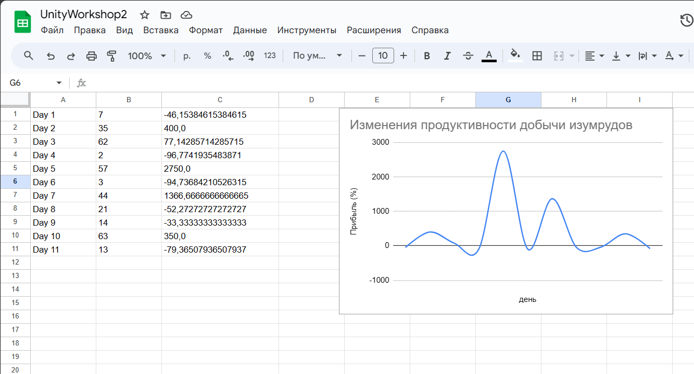
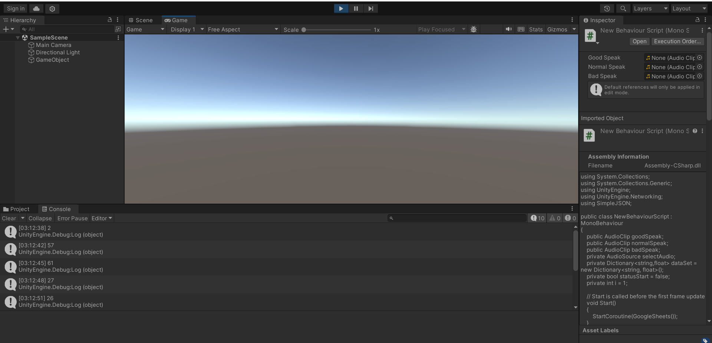

# АНАЛИЗ ДАННЫХ И ИСКУССТВЕННЫЙ ИНТЕЛЛЕКТ [in GameDev]
Отчет по лабораторной работе #2 выполнил:
- Утев Денис Сергеевич
- РИ220944
Отметка о выполнении заданий:

| Задание | Выполнение | Баллы |
| ------ | ------ | ------ |
| Задание 1 | * | 60 |
| Задание 2 | * | 20 |
| Задание 3 | * | 20 |

знак "*" - задание выполнено; знак "#" - задание не выполнено;

Работу проверили:
- к.т.н., доцент Денисов Д.В.
- к.э.н., доцент Панов М.А.
- ст. преп., Фадеев В.О.

[](https://nodesource.com/products/nsolid)


## Цель работы
Выполнить все задания из воркшопа2.

## Задание 1
Ход работы:
- Выбрать одну из компьютерных игр, привезти скриншот её геймплея и краткое описание концепта игры. 
- Выбрать одну из игровых переменных в игре, описать её роль в игре, условия изменения / появления и диапазон допустимых значений. 
- Построить схему экономической модели в игре и указать место выбранного ресурса в ней.

Я выбрал игру Minecraft. 
Вот скриншот её геймплея и краткое описание концепта игры:



Minecraft - игра в жанре песочницы. Игроку дается процедурно генерируемый 3Д мир, состоящий из кубов и дающий игроку возможность перестраивать его как угодно. Конкретной цели в этой игре нет, зато есть свобода.

Я буду рассматривать такой ресурс, как изумруды. Изумруды в игре майнкрафт исполняют роль денег, ведь их сложно найти и это единственный ресурс, за который жители деревень могут дать вам другие предметы. Их можно приобрести, продавая разные предметы жителям, можно найти в сундуках, разбросанных по всему миру, или, копаясь в шахте/под землей можно их встретить в виде блока изумрудной руды, который можно добыть железной, золотой, алмазной, либо незеритовой киркой. Изумрудов в игре настолько много, что собрать их все не представляется возможным.

Схема экономической модели изумрудов в игре Minecraft:



## Задание 2
Ход работы:
- С помощью скрипта на языке Python заполнить google-таблицу данными, описывающими выбранную игровую переменную в выбранной игре. 
- Средствами google-sheets визуализировать данные в google-таблице для наглядного представления выбранной игровой величины.

В этом коде я смоделировал добычу изумрудов в игре. Каждый игровой день мы можем добыть случайное количество изумрудов от 0 до 64. Эти подсчитанные данные попадут в мою гугл таблицу, где я построю график изменений количества добычи в каждый день.

```python
import gspread
import numpy as np
gc = gspread.service_account(filename='unitydatascience-405215-87da4d6be23c.json')
sh = gc.open("UnityWorkshop2")
price = np.random.randint(0, 64, 11)
mon = list(range(1,11))
i = 0
while i <= len(mon):
    i += 1
    if i == 0:
        continue
    else:
        if (price[i - 2] == 0):
            tempInf = "Infinity"
        else:
            tempInf = ((price[i-1]-price[i-2])/price[i-2])*100
        num1 = tempInf
        num2 = price[i-1]
        tempInf = str(tempInf)
        tempInf = tempInf.replace('.',',')
        sh.sheet1.update(('A' + str(i)), str(i))
        sh.sheet1.update(('B' + str(i)), str(price[i-1]))
        sh.sheet1.update(('C' + str(i)), str(tempInf))
        sh.sheet1.update(('H' + str(i)), num1)#Для анализа в графике (нужен тип float)
        sh.sheet1.update(('I' + str(i)), float(num2))#Для анализа в графике (нужен тип float)
        print(tempInf)

```

Вот сама таблица с графиком изменения добычи изумрудов:

https://docs.google.com/spreadsheets/d/10UMu1RjGPR-SGPFLEMx-e_FeBY9rOnS2Ar_pH5Gy4IA/edit#gid=0


## Задание 3
Ход работы: 
- Настроить на сцене Unity воспроизведение звуковых файлов, описывающих динамику изменения выбранной переменной. 

Я решил в Unity анализировать количество добытых изумрудов в каждый день. Если это количество превышает 42, то воспроизводится PlaySelectAudioGood(), если от 20 до 42, то воспроизводится PlaySelectAudioNormal(), иначе играет PlaySelectAudioBad().

Я запустил сцену, проверил, всё работает!

Скриншот логов в Unity:



Код:
[Относительная ссылка на документ](assets/UnityBihaviourScrpit.cs)


## Выводы

Я выполнил задания воркшопа2.

| Plugin | README |
| ------ | ------ |
| Dropbox | [plugins/dropbox/README.md][PlDb] |
| GitHub | [plugins/github/README.md][PlGh] |
| Google Drive | [plugins/googledrive/README.md][PlGd] |
| OneDrive | [plugins/onedrive/README.md][PlOd] |
| Medium | [plugins/medium/README.md][PlMe] |
| Google Analytics | [plugins/googleanalytics/README.md][PlGa] |

## Powered by

**UTEV DENIS**
